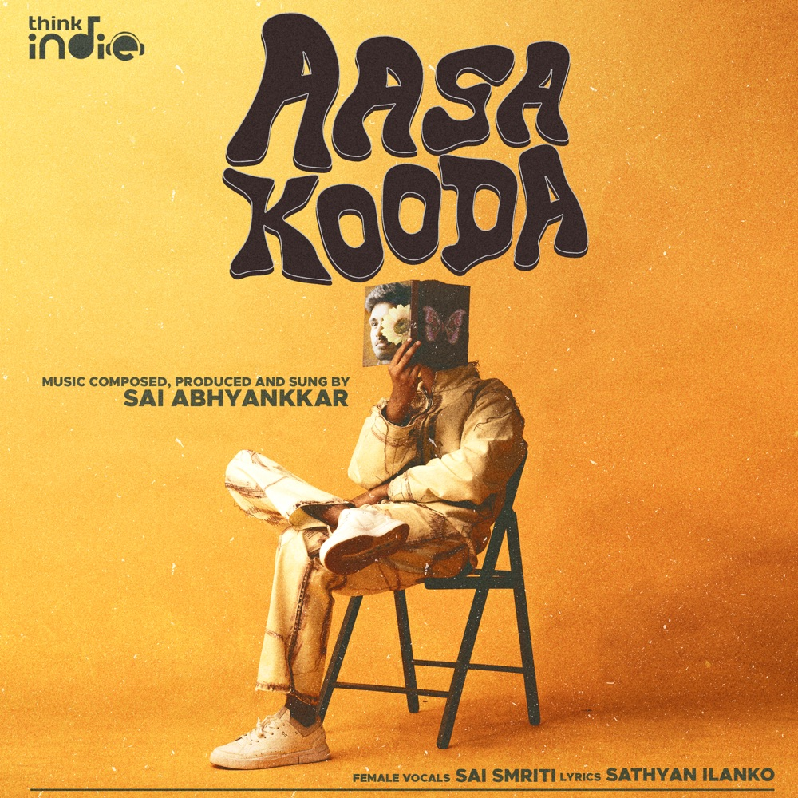

**HTML:-**

<!DOCTYPE html>
<html lang="en">
<head>
    <meta charset="UTF-8">
    <meta name="viewport" content="width=device-width, initial-scale=1.0">
    <link rel="preconnect" href="https://fonts.googleapis.com">
    <link rel="preconnect" href="https://fonts.gstatic.com" crossorigin>
    <link href="https://fonts.googleapis.com/css2?family=Montserrat:ital,wght@0,100..900;1,100..900&display=swap" rel="stylesheet">
    <link rel="icon" href="./assets/logo.png">
    <link rel="stylesheet" href="style.css">
    <link rel="stylesheet" href="https://cdnjs.cloudflare.com/ajax/libs/font-awesome/6.7.2/css/all.min.css"/>
    
    <title>Spotify - Web Player: Music for everyone</title>
</head>
<body>
    

        

            

                 

                    <i class="fa-solid fa-house"></i>
                    <a href="#">Home</a>
                 

                 

                    <i class="fa-solid fa-magnifying-glass"></i>
                    <a href="#">Search</a>
                 

            

            

                

                    

                        
                        <a href="#">Your Library</a>
                    

                    

                        <i class="fa-solid fa-plus"></i>
                        <i class="fa-solid fa-arrow-right"></i>
                    

                

                

                

                    
Create your first playlist

                    
It's easy, we'll help you

                    <button class="badge">Create playlist</button>
                

            

            

                

                    
Let's find some podcasts to follow

                    
We'll keep you updates on new episodes

                    <button class="badge">Browse podcasts</button>
                

            

            

            
        

        

            

                

                     
                     
                

               

                <button class="badge nav-items hide">Explore Premium</button>
                <button class="badge nav-items dark-badge"><i class="fa-solid fa-circle-arrow-down" style="margin-right: 5px;"></i>Install App</button>
                <i class="fa-solid fa-user nav-items"></i>
               

                
            

           

                <h2>Recently Played</h2>
                

                    

                    
                    
Top 50 - Global

                    
Your daily updates of the most played...

                

            

       
            <h2>Trending now near you</h2>
                

                    

                    
                    
Top 50 - Global

                    
Your daily updates of the most played...

                

              
                    

                    
                    
Top 50 - Global

                    
Your daily updates of the most played...

                

                
                    

                    
                    
Top 50 - Global

                    
Your daily updates of the most played...

                

               
                    

                    
                    
Top 50 - Global

                    
Your daily updates of the most played...

                

                
                    

                    
                    
Top 50 - Global

                    
Your daily updates of the most played...

                

            

            <h2>Featured Charts</h2>
                

                    

                    
                    
Top 50 - Global

                    
Your daily updates of the most played...

                

                

                    
                    
Top Songs - India

                    
Your daily updates of the most played...

                

                

                    
                    
Top 50 - Global

                    
Your daily updates of the most played...

                

            

            

                

            

        

        

            

                
                

                    
<a href="#">Aasa Kooda - From "Think Indie"</a>

                    
<a href="#">Sai Abhaynkkar,Sai Smriti</a>

                

                 <i class="fa-solid fa-heart"></i>
            

            

                

                     
                     
                     
                    
                     
                

                

                    00:00
                    <input type="range" min="0" max="100" class="progress-bar"
                    03:33
                

            

            
right

        

    

</body>
</html>

**CSS:-**

body {
  font-family: "Montserrat", sans-serif;
  font-optical-sizing: auto;
  font-weight: <weight>;
  font-style: normal; 
}

body{
    margin: 0;
    background-color: #000;
    color: #fff;
    overflow: hidden;
}

.main{
    display: flex;
    height: 100vh;
    padding: 0.5rem;
}
.sidebar{
    background-color: #000;
    width: 340px;
    border-radius: 1rem;
    margin-right: 0.5rem;
}
.main-content{
    background-color: #121212;
    flex: 1;
    border-radius: 1rem;
    overflow: auto;
    padding: 0 1.5rem 0 1.5rem;
}
.music-player{
    background-color: #000;
    position: fixed;
    bottom: 0;
    width: 100%;
    height: 72px;
}
a{
    text-decoration: none;
    color: #fff;
    
}
.nav{
    background-color: #121212;
    border-radius: 1rem;
    display: flex;
    flex-direction: column;
    justify-content: center;
    height: 100px;
    padding: 0.5rem  0.75rem;
}
.nav-option{
    line-height: 2.5rem;
    opacity: 0.7;
    padding: 0.5rem 0.75rem;
}
.nav-option:hover{
    opacity: 1;
}
.nav-option i{
    font-size: 1.25rem;
}
.nav-option a{
    font-size: 1rem;
    margin-left: 1rem;
}
.library{
    background-color: #121212;
    border-radius: 1rem;
    height: 100%;
    margin-top: 0.5rem;
    padding: 0.5rem 0.75rem;
    overflow: auto;
}
.options{
    display: flex;
    justify-content: space-between;
    align-items: center;
}
.lib-option img{
    height: 1.25rem;
    width: 1.25rem;
}
.icons{
    font-size: 1.23rem;
    display: flex;
}
.icons i{
    opacity: 0.7;
    margin-right: 1rem ;
}
.icons i:hover{
    opacity: 1;
}
.box{
    background-color: #232323;
    height: 8rem;
    border-radius: 0.75rem;
    margin: 0.5rem 0 1.75rem 0;
    padding: 0.75rem 1rem;
}
.box-p1{
    font-size: 1rem;
    font-weight: 500;
}
.box-p2{
    font-size: 0.75rem;
    opacity: 0.9;
}
.badge{
    background-color: #fff;
    border: none;
    border-radius: 100px;
    padding: 0.25rem 1rem;
    font-weight: 700;
    margin-top: 0.5rem;
    height: 2rem;
    width: fit-content;
}
.dark-badge{
    background-color: #000;
    color: #fff;
}
.sticky-nav{
    position: sticky;
    top: 0;
    background-color: #121212;
    display: flex;
    justify-content: space-between;
    align-items: center;
    padding: 1rem 0 1rem 0;
    z-index: 10;
}
.sticky-nav-icons{
    margin-left: 0.75rem;
}
.sticky-nav-options{
    display: flex;
    justify-content: center;
    align-items: center;

}
.nav-items{
    margin-right: 1rem;
}
@media (max-width: 1000px){
    .hide{
        display: none;
    } 
}
.card{
    background-color: #232323;
    width: 150px;
    border-radius: 0.5rem;
    padding: 1rem;
    margin-left: 1.5rem;
    margin-top: 1rem;
}
.card-container{
    display: flex;
    flex-wrap: wrap;
}
.card-img{
    width: 100%;
    border-radius: 0.5rem;
}
.card-title{
    font-weight: 600;
}
.card-info{
    font-size: 0.85rem;
    opacity: 0.8;
}
.footer{
    height: 300px;
    display: flex;
    align-items: center;
    justify-content: center;
}

.line{
    width: 90%;
    height: 30%;
    border-top: 1px solid white;
    opacity: 0.4;
}
.music-player{
    display: flex;
    justify-content: space-between;
    align-items: center;
}
.left{
    width: 25%;
    display: flex;
    align-items: center;
    gap: 15px;
}
.middle{
    width: 50%;
}
.right{
    width: 25%;
}
.left img{
    width: 50px;
    height: 50px;
    border-radius: 4px;
    object-fit: cover;
    margin-left: 1rem;
    padding-left: 1.5rem;
}

.song-info{
    display: flex;
    flex-direction: column;
    gap: 1px;  
}
.card-title, .card-info {
  margin: 0;
  font-size: 14px;
  line-height: 1.5;    
}

.player-control{
    display: flex;
    justify-content: center;
    align-items: center;
}
.player-conrol-icon{
    height: 1rem;
    margin-right: 1.75rem;
    opacity: 0.7;
}
.player-conrol-icon:hover{
    opacity: 1;
}
.playback-bar{
    display: flex;
    justify-content: center;
    align-items: center;
}
.progress-bar{
    width: 70%;
    appearance: none;
    background-color: transparent;
    cursor: pointer;
}
.progress-bar::-webkit-slider-runnable-track{
    background-color: #ddd;
    border-radius: 100px;
    height: 0.2rem;
}

.progress-bar::-webkit-slider-thumb{
    appearance: none;
    height: 16px;
    width: 16px;
    background-color: #1bd768;
    border-radius: 50%;
}
